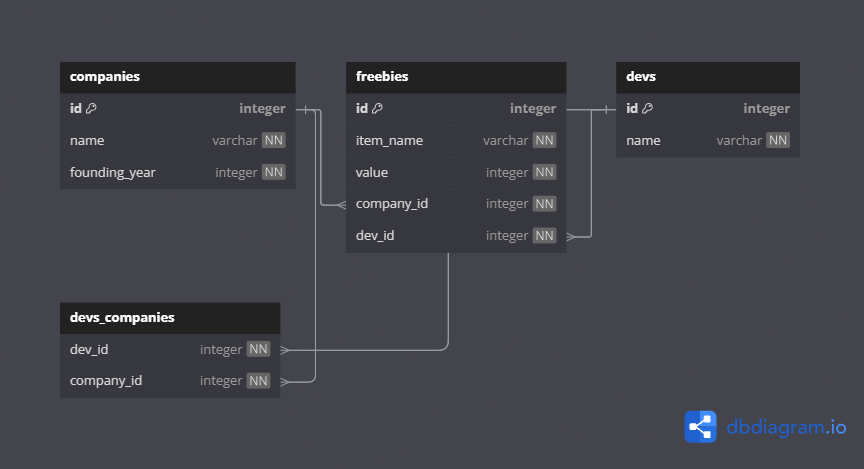

# Freebie Tracker

## Description

A SQLAlchemy-based app that tracks developers, companies, and the 
freebies companies give to developers. The project explores one-to-many and many-to-many relationships, model-level methods, and CLI-based querying via `debug.py`.

***

## Tech Stack
- *python 3.12*: core programming language
- *SQLAlchemy*: ORM for managing models and database relationships
- *SQLite*: Lightweight relational database
- *Alembic*: Database migrations
- *Faker*: Generating fake names, companies, and values
- *pipenv*: Dependency and virtual environment manager
- *pdb*: Interactive debugging in Python 

***

## Entity Relationship Diagram (ERD)

To identify Freebie as the `Source of Truth` and understand the relationships, interact with the following ERD diagram:


  
***

## Model Overview

The model is such that: a `Company` has many `Freebie`s, a `Dev` has many `Freebie`s,
and a `Freebie` belongs to a `Dev` and to a `Company`.

`Company` - `Dev` is a many to many relationship, facilitated by the `company-dev` Association Table. 

***

## Usage

To get started:
### Fork and clone this repository:

```console
$ git clone https://github.com/<your-username>/<your-repo-name>.git
cd <your-repo-name>/lib
```

### Install dependencies and activate virtual environment:
Inside your directory, run `pipenv install && pipenv shell`.

### Reset and seed the database:

```console
$ cd lib/
$ python3 reset_db.py
# => Deleted old database: freebies.db
# => Running alembic migrations ...
# => INFO  [alembic.runtime.migration] Running upgrade ...
# => Seeded database.
# => Reset complete! Begin querying.
```

This will:
- Delete the old SQLite database (freebies.db)

- Run all Alembic migrations

- Seed new fake data using Faker

### Start the interactive debugger:

This lets you test queries and helper functions in a live session.

```console
$ cd lib/
$ python3 debug.py
```

### Try out a few example queries:
Once inside the debugger `(pdb> prompt)`, you can run things like:

```console
session.query(Dev).first()
get_devs_with_this_freebie(session, 'Pens')
create_dev(session, "Jane Doe")
update_freebie_value(session, 3, 75)
```

**note** You can exit debugger session with `exit()`

*** 

## Contributions 
- Create a feature branch: `git checkout -b your-feature`

- Commit your changes: `git commit -m "Add feature"`

- Push to your fork: `git push origin your-feature`

- Open a Pull Request

**Caution:** Please ensure changes are tested and maintain clean code practices.

## License 
This project is licensed under the *MIT License*.

## Author
Developed with ❤️ by *Wanjiru Muchiri*


